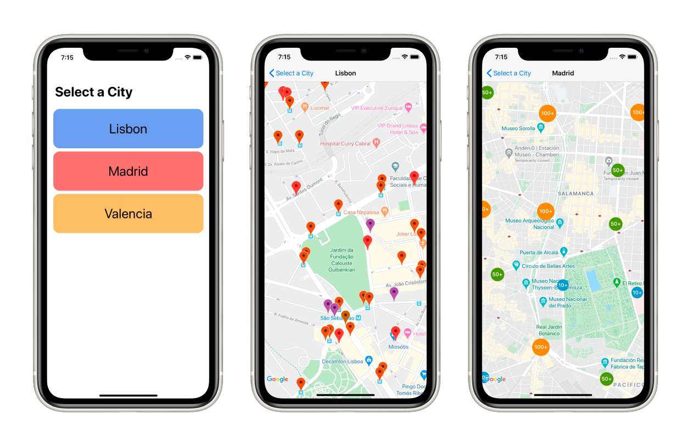

    

# MeepMap

A simple iOS application that uses the Meep API to display some resources on GoogleMaps for different cities.

## Requirements
Before running the app either in the simulator or on a device, two things need to be done:
1. For this technical challenge, GoogleMaps has been used through Cocoapods. Make sure to run 'pod install' to install the necessary pods.
2. GoogleMaps needs to be provided with an API key to execute correctly. This can be done in the AppDelegate file, using the mapsAPIKey property.

## Outline
The app shows a list of some cities found through the Meep API. Tap on one to select a city and it will display a map with some resources.

These resources are different modes of transportation that can be found throughout the city. Each resource will show a different color based on the zone ID.

Tapping on one of the markers will show a default window with some information about the selected resource. The map uses clustering when zooming out, making it easier to navigate.

## Architecture
The application employs the Model-View-ViewModel pattern, giving a clean separation of concerns between the views and the data.

This pattern is especially useful because the app is developed using SwiftUI and Combine, which makes the app reactive.

The application makes heavy use of protocols, which makes the app more testable using the unit and integrations tests that are included in its own target.
